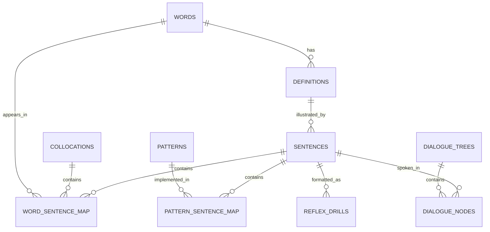

# Kiến Trúc Hệ Thống Dataset Tiếng Anh (English Dataset System Architecture)

> **CEO Strategic Review Status:** SELECTIVE EXPANSION APPROVED  
> **Engineering Manager Review Status:** APPROVED FOR IMPLEMENTATION (LOCKED PLAN)  
> **Key Focus:** Mở rộng Schema để hỗ trợ **Cây Hội Thoại Rẽ Nhánh (Scenario Trees)** và **Thẻ Phản Xạ Nhanh (Reflex Drills)**, kèm theo thiết kế kỹ thuật chống đứt gãy ETL, đảm bảo tính Idempotent và tối ưu SQLite Index.

---

## 1. Tổng Quan Hệ Thống

Hệ thống được thiết kế theo mô hình **Automated ETL & Linguistic Enrichment Pipeline** nhằm tự động hóa việc thu thập, làm sạch, phân tích cú pháp, gán nhãn độ khó, tạo âm thanh và đóng gói dữ liệu tiếng Anh (Từ vựng, Collocations, Mẫu câu, Kịch bản hội thoại) mà **không tiêu tốn chi phí API LLM thương mại**.

```
[Raw Open Sources] ──> [1. Ingestion Layer] ──> [2. NLP & Reflex Enrichment] ──> [3. Media Generation] ──> [4. Export Layer (SQLite/JSON)]
 (Kaikki, Tatoeba,        (Parsers, Cleaning)      (spaCy, Chunking, Pattern,     (Edge-TTS, IPA,         (Mobile Offline App DB)
  OPUS, Subtitles)                                  Scenario & Reflex Builder)    Audio Alignment)
```

---

## 2. Mô Hình Dữ Liệu Quan Hệ Nâng Cấp (Selective Expansion Schema)

Dưới đây là thiết kế chuẩn hóa (Relational Schema) tối ưu cho Spaced Repetition (SRS), truy vấn mẫu câu, **bài tập phản xạ tốc độ cao (< 2.5s)** và **kịch bản hội thoại rẽ nhánh**.



### Chi tiết các Bảng Dữ Liệu:

1. **`words` (Từ vựng & Nguyên thể)**
   - `id`: INTEGER PRIMARY KEY AUTOINCREMENT
   - `lemma`: TEXT UNIQUE NOT NULL (Từ gốc: e.g., "run", "make")
   - `pos`: TEXT NOT NULL (Part of Speech: noun, verb, adj...)
   - `ipa_uk`: TEXT (Phiên âm UK)
   - `ipa_us`: TEXT (Phiên âm US)
   - `frequency_rank`: INTEGER (Thứ tự tần suất theo SUBTLEX-US)
   - `cefr_level`: TEXT (A1, A2, B1, B2, C1, C2)

2. **`collocations` (Cụm từ cố định & Phrasal Verbs - Selective Expansion)**
   - `id`: INTEGER PRIMARY KEY AUTOINCREMENT
   - `phrase`: TEXT UNIQUE NOT NULL (Ví dụ: "take a break", "look forward to", "pay attention")
   - `meaning_vi`: TEXT (Dịch nghĩa tiếng Việt)
   - `pos_pattern`: TEXT (Cấu trúc: `verb + noun`, `verb + preposition`)
   - `cefr_level`: TEXT

3. **`definitions` (Nghĩa & Giải thích)**
   - `id`: INTEGER PRIMARY KEY AUTOINCREMENT
   - `word_id`: INTEGER NOT NULL (FK -> words.id)
   - `definition_en`: TEXT (Giải thích tiếng Anh)
   - `definition_vi`: TEXT (Dịch nghĩa tiếng Việt)
   - `example`: TEXT (Ví dụ đi kèm)
   - `source`: TEXT (Kaikki, Wiktionary, EVDP...)

4. **`sentence_patterns` (Mẫu câu giao tiếp)**
   - `id`: INTEGER PRIMARY KEY AUTOINCREMENT
   - `pattern_raw`: TEXT NOT NULL (Mẫu gốc: e.g., "It takes + [person] + [time] + to V")
   - `pattern_regex`: TEXT (Regex nhận diện trong văn bản)
   - `category`: TEXT (Grammar, Idiom, Spoken Pattern)
   - `cefr_level`: TEXT

5. **`sentences` (Kho Câu & Ngữ cảnh)**
   - `id`: INTEGER PRIMARY KEY AUTOINCREMENT
   - `text_en`: TEXT UNIQUE NOT NULL (Câu tiếng Anh)
   - `text_vi`: TEXT (Câu dịch tiếng Việt)
   - `difficulty_score`: REAL (Điểm độ khó dựa trên độ hiếm của từ vựng)
   - `cefr_level`: TEXT
   - `audio_path`: TEXT (Đường dẫn file audio .mp3/.ogg)
   - `source`: TEXT (Tatoeba, OPUS, OpenSubtitles)

6. **`dialogue_trees` & `dialogue_nodes` (Kịch bản Hội thoại Rẽ nhánh - Selective Expansion)**
   - `dialogue_trees`: `id`, `title`, `topic` (Restaurant, Hotel, Airport...), `cefr_level`, `root_node_id`
   - `dialogue_nodes`:
     - `id`: INTEGER PRIMARY KEY AUTOINCREMENT
     - `tree_id`: INTEGER NOT NULL (FK -> dialogue_trees.id)
     - `parent_node_id`: INTEGER (FK -> dialogue_nodes.id cho nhánh trả lời)
     - `choice_label`: TEXT (Nhãn lựa chọn của người học: e.g., "Ask for menu" / "Ask for bill")
     - `speaker_role`: TEXT NOT NULL (A: Bot / B: User)
     - `sentence_id`: INTEGER (FK -> sentences.id)

7. **`reflex_drills` (Bài tập Luyện Phản xạ - Selective Expansion)**
   - `id`: INTEGER PRIMARY KEY AUTOINCREMENT
   - `sentence_id`: INTEGER NOT NULL (FK -> sentences.id)
   - `drill_type`: TEXT NOT NULL (`audio_shadowing`, `speed_translation`, `missing_chunk_fill`)
   - `prompt_text`: TEXT (Hiển thị gợi ý hoặc phát audio)
   - `correct_answer`: TEXT NOT NULL (Đáp án chuẩn)
   - `distractors_json`: TEXT (Mảng JSON chứa 3 đáp án nhiễu được pre-generate)
   - `target_time_ms`: INTEGER DEFAULT 2500 (Thời gian phản xạ mục tiêu)

---

## 3. Các Tầng Trong Ingestion & Processing Pipeline

### Tầng 1: Ingestion Layer (Thu thập dữ liệu thô)
- **Kaikki.org JSON Dump:** Parse file `kaikki.org-dictionary-English.json` theo stream (`ijson`) để trích xuất Từ vựng, POS, IPA, Etymology, Definitions.
- **Tatoeba Aligned Corpus:** Lọc câu tiếng Anh - tiếng Việt chất lượng cao từ `sentences.csv` & `links.csv`.
- **OPUS Subtitles:** Khai thác các câu hội thoại ngắn (2-10 từ) từ OpenSubtitles để làm nguyên liệu dựng `dialogue_nodes`.

### Tầng 2: NLP Processing & Reflex Enrichment Layer (Xử lý & Tạo Dữ Liệu Phản Xạ)
- **Lemmatization & POS Tagging (spaCy `en_core_web_sm` / `md`):** Đưa từ về nguyên thể, gán nhãn từ loại qua `nlp.pipe(texts, batch_size=500)` để tối ưu RAM.
- **Chunking & Collocation Mining:** Trích xuất các cụm từ đi liền nhau thông qua Dependency Parsing (`Noun Chunking` & `Verb-Noun Pairs`).
- **Reflex Generator:** Tự động tạo 3 lựa chọn nhiễu (distractor options) cùng CEFR level từ kho câu để phục vụ dạng bài tập phản xạ tốc độ cao.
- **Tự động chấm độ khó (Automatic CEFR Grading):** Dựa trên danh sách tần suất SUBTLEX-US / Oxford 3000-5000.

### Tầng 3: Media & Audio Generation Layer
- **Audio Generation (Edge-TTS):** Dùng `edge-tts` (Python) tạo audio chuẩn Neural với `asyncio.Semaphore(5)` để chống bị rate-limit. Sinh 2 tốc độ: **Standard (1.0x)** và **Fast Reflex (1.2x)**.
- **Phonetic & IPA Alignment:** Map phiên âm IPA từ Kaikki / G2P fallback.

### Tầng 4: Export Layer (Đóng gói cho Mobile App)
- Export dữ liệu sang file **SQLite DB (`english_dataset.db`)** (< 60MB cho 20,000 từ, 50,000 câu, 1,000 bài tập phản xạ và 50 kịch bản hội thoại).
- Đánh Index đa cột tối ưu:
  - `CREATE UNIQUE INDEX idx_words_lemma ON words(lemma);`
  - `CREATE INDEX idx_reflex_cefr_type ON reflex_drills(drill_type, sentence_id);`
  - `CREATE INDEX idx_nodes_tree_parent ON dialogue_nodes(tree_id, parent_node_id);`
  - `CREATE INDEX idx_word_sentence_join ON word_sentence_map(word_id, sentence_id);`

---

## 4. Khuyến Nghị Công Nghệ (Tech Stack Recommendation)

| Thành phần | Công nghệ đề xuất | Lý do lựa chọn |
| :--- | :--- | :--- |
| **Pipeline Language** | **Python 3.11+** | Hệ sinh thái xử lý dữ liệu và NLP phong phú nhất (spaCy, Polars, DuckDB, Asyncio). |
| **Pipeline DB / Staging** | **DuckDB** hoặc **PostgreSQL** | DuckDB cực nhanh cho xử lý ETL file JSON/CSV lớn mà không cần setup server phức tạp. |
| **Mobile App Export DB** | **SQLite** | Tương thích 100% với iOS (SwiftData/FMDB), Android (Room/SQLite), React Native & Flutter. |
| **NLP Framework** | **spaCy** | Tốc độ xử lý cực nhanh (C-extension), hỗ trợ Lemmatization, Chunking & Dependency Parsing. |
| **Text-to-Speech (TTS)** | **edge-tts** / **Kokoro-TTS** | `edge-tts` miễn phí 100%, chất lượng Neural như người thật, hỗ trợ điều chỉnh tốc độ đọc (speed rate). |
| **Optional Hybrid AI** | **Ollama** (`qwen2.5` / `llama3.2`) | Dùng chạy local (zero-cost) để tự động sửa dịch câu tiếng Việt mượt mà và gán nhãn Ngữ cảnh kịch bản hội thoại. |

---

## 5. Kế Hoạch Triển Khai Từng Bước (Roadmap)

1. **Pha 1: Xây dựng Bộ Từ Vựng & Collocation Core (Vocabulary & Chunks)**
   - Viết parser đọc Kaikki JSON -> Trích xuất 10,000 từ thông dụng + 3,000 Collocations -> Map tần suất SUBTLEX -> Lưu SQLite.
2. **Pha 2: Khai Thác Mẫu Câu & Bài Tập Phản Xạ (Reflex & Sentence Core)**
   - Lọc 100,000 câu Tatoeba/OPUS -> Chạy spaCy Lemmatize -> Tự động sinh `reflex_drills` kèm distractors pre-generated.
3. **Pha 3: Dựng Cây Hội Thoại Rẽ Nhánh (Scenario Tree Engine)**
   - Dùng ngữ cảnh từ OpenSubtitles / Local LLM gán nhãn để dựng 50 kịch bản hội thoại rẽ nhánh dạng cây (`dialogue_nodes`).
4. **Pha 4: Tạo Âm Thanh Tốc Độ Kép & Đóng Gói (Dual-Speed Audio & Mobile Pack)**
   - Sinh file `.mp3` cho câu & hội thoại ở tốc độ chuẩn (1.0x) và tốc độ phản xạ (1.2x) bằng `edge-tts` -> Export file `english_dataset.db`.

---

## 6. Báo Cáo Đánh Giá CEO (GSTACK CEO REVIEW REPORT)

### 📌 Chiến Lược & Điểm Khác Biệt (Product Differentiation)
- **Vấn đề của thị trường:** Hầu hết ứng dụng học tiếng Anh miễn phí chỉ dừng lại ở từ điển tĩnh hoặc bài tập trắc nghiệm thụ động. Người học thuộc từ nhưng không bật ra phản xạ nói được.
- **Giải pháp khác biệt:** Bổ sung cấu trúc **Cây hội thoại rẽ nhánh** và **Thẻ phản xạ tốc độ cao** ngay ở tầng dữ liệu. Động cơ học tập chuyển từ "Ghi nhớ từ vựng" sang "Rèn luyện phản xạ < 2.5 giây".

---

## 7. Báo Cáo Đánh Giá Kỹ Thuật (GSTACK ENG MANAGER REVIEW REPORT)

### 🛡️ 1. Tính An Toàn & Khôi Phục Sự Cố ETL (Idempotency & Resilience)
- **Cơ chế khôi phục (Resume on Crash):** Toàn bộ script ETL ghi dữ liệu bằng các câu lệnh `INSERT OR IGNORE` hoặc `ON CONFLICT (lemma) DO UPDATE` dựa trên trường `UNIQUE` (`words.lemma`, `collocations.phrase`, `sentences.text_en`).
- **Giao tác theo lô (Batch Transactions):** Sử dụng `BEGIN TRANSACTION` và `COMMIT` sau mỗi 1,000 bản ghi. Nếu quá trình ETL bị dừng đột ngột (do ngắt điện/Ctrl+C), dữ liệu đã commit không bị hỏng, và việc chạy lại script sẽ tiếp tục từ bản ghi dở dở mà không gây nhân đôi dữ liệu.

### ⚡ 2. Quản Lý Bộ Nhớ & Tối Ưu Tốc Độ Viết File
- **Tối ưu RAM khi Parse JSON lớn:** Đọc file Kaikki JSON (gần 1GB) theo dạng streaming với `ijson.items(f, 'item')` thay vì `json.load()` toàn bộ file vào bộ nhớ.
- **Tốc độ ghi SQLite cực nhanh lúc Build:**
  - Thiết lập tạm thời lúc build DB: `PRAGMA synchronous = OFF; PRAGMA journal_mode = MEMORY;`
  - Sau khi hoàn thành đóng gói, bật lại `PRAGMA journal_mode = WAL; PRAGMA synchronous = NORMAL;` để tối ưu cho môi trường đọc đa luồng trên Di Động.

### 📶 3. Kiểm Soát Rate-Limit & Tải Âm Thanh
- **Song song có kiểm soát (Async Semaphore):** Khi gọi `edge-tts` để sinh 5,000 file audio, sử dụng `asyncio.Semaphore(5)` để duy trì tối đa 5 kết nối đồng thời.
- **Cơ chế Retry (Exponential Backoff):** Nếu gặp lỗi mạng hoặc HTTP 429 từ Edge TTS endpoint, script sẽ tự động retry 3 lần với khoảng thời gian chờ tăng dần (1s, 3s, 7s).

### 🧪 4. Chiến Lược Kiểm Thử Kỹ Thuật (Test & Validation Plan)
- **Kiểm tra tính toàn vẹn khóa ngoại (Foreign Key Validation):**
  Chạy lệnh `PRAGMA foreign_key_check;` trên file SQLite cuối cùng để đảm bảo không có bản ghi mồ côi (orphan records) trong các bảng mapping.
- **Kiểm tra định dạng JSON:**
  Viết unit test kiểm tra toàn bộ trường `reflex_drills.distractors_json` có thể parse hợp lệ bằng JSON parser và chứa đúng 3 phẩn tử string.
- **Benchmark Tốc Độ Truy Vấn:**
  Đảm bảo câu lệnh `SELECT * FROM reflex_drills WHERE drill_type = 'speed_translation' AND cefr_level = 'B1' ORDER BY RANDOM() LIMIT 1;` hoàn thành dưới **5ms** trên thiết bị di động thử nghiệm.
