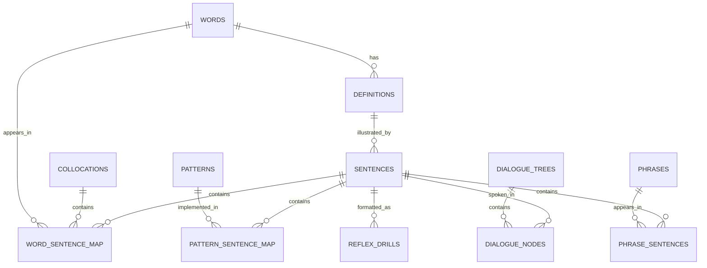

# English Dataset System Architecture

> **CEO Strategic Review Status:** SELECTIVE EXPANSION APPROVED  
> **Engineering Manager Review Status:** APPROVED FOR IMPLEMENTATION (LOCKED PLAN)  
> **Key Focus:** Schema expansion supporting **Branching Dialogue Trees (Scenario Trees)** and **Speed Reflex Drills**, featuring idempotent ETL crash resilience, batch transaction safety, and mobile SQLite index optimization.

---

## 1. System Overview

The system follows an **Automated ETL & Linguistic Enrichment Pipeline** architecture designed to automate raw dataset collection, cleaning, parsing, CEFR difficulty grading, neural TTS audio synthesis, and offline SQLite database packaging—**without incurring commercial LLM API costs**.

```
[Raw Open Sources] ──> [1. Ingestion Layer] ──> [2. NLP & Reflex Enrichment] ──> [3. Media Generation] ──> [4. Export Layer (SQLite/JSON)]
 (Kaikki, Tatoeba,        (Parsers, Cleaning)      (spaCy, Chunking, Pattern,     (Edge-TTS, IPA,         (Mobile Offline App DB)
  OPUS, Subtitles)                                  Scenario & Reflex Builder)    Audio Alignment)
```

---

## 2. Relational Database Schema (Selective Expansion Schema)

Below is the normalized relational schema optimized for Spaced Repetition (SRS), sentence pattern queries, **high-speed reflex cards (< 2.5s reaction target)**, and **branching dialogue scenarios**.



### Table Definitions

1. **`words` (Lemmas & Vocabulary)**
   - `id`: INTEGER PRIMARY KEY AUTOINCREMENT
   - `lemma`: TEXT UNIQUE NOT NULL (Base word form: e.g., "run", "make")
   - `pos`: TEXT NOT NULL (Part of Speech: noun, verb, adj...)
   - `ipa_uk`: TEXT (UK IPA phonetic transcription)
   - `ipa_us`: TEXT (US IPA phonetic transcription)
   - `frequency_rank`: INTEGER (SUBTLEX-US word frequency rank)
   - `cefr_level`: TEXT (A1, A2, B1, B2, C1, C2)

2. **`collocations` (Phrasal Verbs & Fixed Expressions)**
   - `id`: INTEGER PRIMARY KEY AUTOINCREMENT
   - `phrase`: TEXT UNIQUE NOT NULL (e.g., "take a break", "look forward to", "pay attention")
   - `meaning_vi`: TEXT (Target language translation)
   - `pos_pattern`: TEXT (Grammar pattern: `verb + noun`, `verb + preposition`)
   - `cefr_level`: TEXT

3. **`definitions` (Senses & Explanations)**
   - `id`: INTEGER PRIMARY KEY AUTOINCREMENT
   - `word_id`: INTEGER NOT NULL (FK -> words.id)
   - `definition_en`: TEXT (English definition)
   - `definition_vi`: TEXT (Target translation)
   - `example`: TEXT (Usage example sentence)
   - `source`: TEXT (Kaikki, Wiktionary, EVDP)

4. **`sentence_patterns` (Grammatical Sentence Structures)**
   - `id`: INTEGER PRIMARY KEY AUTOINCREMENT
   - `pattern_raw`: TEXT NOT NULL (Base pattern: e.g., "It takes + [person] + [time] + to V")
   - `pattern_regex`: TEXT (Regex pattern matcher)
   - `category`: TEXT (Grammar, Idiom, Spoken Pattern)
   - `cefr_level`: TEXT

5. **`sentences` (Contextual Sentence Corpus)**
   - `id`: INTEGER PRIMARY KEY AUTOINCREMENT
   - `text_en`: TEXT UNIQUE NOT NULL (English sentence text)
   - `text_vi`: TEXT (Target translation text)
   - `difficulty_score`: REAL (Difficulty score computed from constituent word rarity)
   - `cefr_level`: TEXT
   - `audio_path`: TEXT (Relative path to .mp3 file)
   - `source`: TEXT (Tatoeba, OPUS, OpenSubtitles)

6. **`dialogue_trees` & `dialogue_nodes` (Branching Dialogue Scenarios)**
   - `dialogue_trees`: `id`, `title`, `topic` (Restaurant, Hotel, Airport...), `cefr_level`, `root_node_id`
   - `dialogue_nodes`:
     - `id`: INTEGER PRIMARY KEY AUTOINCREMENT
     - `tree_id`: INTEGER NOT NULL (FK -> dialogue_trees.id)
     - `parent_node_id`: INTEGER (FK -> dialogue_nodes.id for branch responses)
     - `choice_label`: TEXT (Learner choice label: e.g., "Ask for menu" / "Ask for bill")
     - `speaker_role`: TEXT NOT NULL (A: Bot/Partner, B: Learner)
     - `sentence_id`: INTEGER (FK -> sentences.id)

7. **`reflex_drills` (Speed Reaction Cards)**
   - `id`: INTEGER PRIMARY KEY AUTOINCREMENT
   - `sentence_id`: INTEGER NOT NULL (FK -> sentences.id)
   - `drill_type`: TEXT NOT NULL (`audio_shadowing`, `speed_translation`, `missing_chunk_fill`)
   - `prompt_text`: TEXT (Prompt display or audio trigger)
   - `correct_answer`: TEXT NOT NULL (Target answer)
   - `distractors_json`: TEXT (JSON array containing 3 pre-generated distractor options)
   - `target_time_ms`: INTEGER DEFAULT 2500 (Target response time in milliseconds)

8. **`phrases` (Multi-Word Expressions)**
   - `id`: INTEGER PRIMARY KEY AUTOINCREMENT
   - `phrase`: TEXT UNIQUE NOT NULL (Idioms, phrasal verbs, proverbs, fixed expressions)
   - `phrase_type`: TEXT NOT NULL (idiom, phrasal_verb, proverb, phrase)
   - `pos`: TEXT (Part of Speech from Kaikki)
   - `cefr_level`: TEXT (Graded from constituent word rarity)
   - `difficulty_score`: REAL (Difficulty score computed from constituent word rarity)
   - `definition_en`: TEXT (English definition)
   - `definition_vi`: TEXT (Vietnamese translation)
   - `ipa`: TEXT (IPA phonetic transcription)
   - `audio_std`: TEXT (Relative path to 1.0x .mp3)
   - `audio_fast`: TEXT (Relative path to 1.2x .mp3)
   - `audio_status`: TEXT DEFAULT 'ok'

9. **`phrase_sentences` (Phrase - Sentence Map)**
   - `phrase_id`: INTEGER NOT NULL (FK -> phrases.id)
   - `sentence_id`: INTEGER NOT NULL (FK -> sentences.id)
   - `rank`: INTEGER (Example sentence priority)
   - PRIMARY KEY (`phrase_id`, `sentence_id`)

---

## 3. Pipeline Layers & Data Flow

### Layer 1: Ingestion Layer
- **Kaikki.org JSON Dump:** Stream-parses `kaikki.org-dictionary-English.json` via `ijson` to extract Vocabulary, POS, IPA, Etymology, Definitions, and Examples.
- **Tatoeba Aligned Corpus:** Filters high-quality English-Vietnamese sentence pairs from `sentences.csv` & `links.csv`.
- **OPUS Subtitles:** Mines conversational dialogue exchanges (2-10 words) from OpenSubtitles for `dialogue_nodes`.

### Layer 2: NLP Processing & Reflex Enrichment Layer
- **Lemmatization & POS Tagging (spaCy `en_core_web_sm`):** Reduces inflected words to lemmas, assigns POS tags via `nlp.pipe(texts, batch_size=500)` for RAM efficiency.
- **Chunking & Collocation Mining:** Mines phrasal verbs and noun chunks using spaCy dependency parsing.
- **Reflex Generator:** Pre-computes 3 distractor choices matching sentence CEFR levels for high-speed drill cards.
- **Automatic CEFR Grading:** Estimates text difficulty using statistical SUBTLEX-US frequency rankings.

### Layer 3: Media & Neural Audio Generation Layer
- **Audio Synthesis (Edge-TTS):** Uses Microsoft Edge-TTS with `asyncio.Semaphore(5)` to prevent rate limiting. Synthesizes dual-speed audio: **Standard (1.0x)** and **Fast Reflex (1.2x)**.
- **Phonetic & IPA Alignment:** Maps Kaikki IPA transcriptions with G2P fallback models.

### Layer 4: Export Layer (Mobile Packaging)
- Packages all staged tables into an optimized **SQLite database (`english_dataset.db`)** (< 60MB for 20,000 words, 50,000 sentences, 1,000 reflex drills, and 50 dialogue trees).
- Applies multi-column composite indexes:
  - `CREATE UNIQUE INDEX idx_words_lemma ON words(lemma);`
  - `CREATE INDEX idx_reflex_cefr_type ON reflex_drills(drill_type, sentence_id);`
  - `CREATE INDEX idx_nodes_tree_parent ON dialogue_nodes(tree_id, parent_node_id);`
  - `CREATE INDEX idx_word_sentence_join ON word_sentence_map(word_id, sentence_id);`

### Step 4G: Multi-Word Expressions (Thành ngữ & Cụm từ cố định)

Re-scans the Kaikki dump to extract idioms, phrasal verbs, proverbs, and fixed expressions (multi-word entries dropped by the single-word ingestion step). Each phrase is:

- Graded for CEFR from constituent words (`PhraseGrader`, reusing `CEFRGrader`)
- Linked to 1-5 Tatoeba example sentences, easy sentences first (`PhraseExampleMatcher`)
- Translated into Vietnamese (Kaikki translations, fallback `Translator`)
- Synthesized into dual-speed 1.0x/1.2x audio (`AudioGenerator.generate_dual_speed_phrase`)

Stored in the `phrases` and `phrase_sentences` tables and exported with `english_dataset.db` using dedicated indexes (`idx_phrases_cefr`, `idx_phrases_type`, ...).

---

## 4. Recommended Technology Stack

| Component | Technology | Rationale |
| :--- | :--- | :--- |
| **Pipeline Language** | **Python 3.11+** | Ecosystem for data processing and NLP (spaCy, Polars, DuckDB, Asyncio). |
| **Pipeline Staging** | **DuckDB / SQLite** | Ultra-fast in-memory/file staging without server setup overhead. |
| **Mobile Export DB** | **SQLite** | 100% native compatibility with iOS (SwiftData/FMDB), Android (Room), React Native & Flutter. |
| **NLP Framework** | **spaCy** | C-extension execution speed for lemmatization, chunking & dependency parsing. |
| **Text-to-Speech (TTS)** | **edge-tts** | Neural voice quality, free, configurable playback speed rate. |
| **Optional Local LLM** | **Ollama** (`llama3.2` / `qwen2.5`) | Zero-cost local execution for dialogue context tagging and alignment. |

---

## 5. Implementation Roadmap

1. **Phase 1: Vocabulary & Collocation Core**
   - Write Kaikki JSON parser -> Extract top 10,000 words + 3,000 collocations -> Map SUBTLEX ranks -> Stage in database.
2. **Phase 2: Sentence Corpus & Reflex Core**
   - Filter 100,000 sentence pairs -> Execute spaCy lemmatization -> Generate `reflex_drills` with pre-computed distractors.
3. **Phase 3: Branching Dialogue Tree Engine**
   - Assemble conversational dialogues from OPUS into tree graphs (`dialogue_nodes`).
4. **Phase 4: Dual-Speed Audio & Mobile Packaging**
   - Synthesize `.mp3` audio files at 1.0x and 1.2x speeds -> Export and index `english_dataset.db`.

---

## 6. Executive Summary & Differentiation (CEO Review)

- **Market Problem:** Most language apps rely on static dictionary lookups or passive multiple-choice flashcards. Learners memorize words but fail to produce spoken responses fluently under pressure.
- **Differentiated Solution:** Embed **Branching Dialogue Trees** and **Speed Reflex Cards** directly at the database layer. Shifts learning focus from passive memorization to sub-2.5 second automaticity drills.

---

## 7. Technical Quality & Security Assurance (Eng Manager Review)

### 🛡️ 1. ETL Idempotency & Crash Resilience
- **Resume-on-Crash Capability:** Ingestion scripts use `INSERT OR IGNORE` and `ON CONFLICT` clauses targeting unique keys (`words.lemma`, `collocations.phrase`, `sentences.text_en`).
- **Batch Transactions:** Wraps database inserts in `BEGIN TRANSACTION` and `COMMIT` every 1,000 rows. Interruptions retain committed data without duplicating records on re-runs.

### ⚡ 2. Memory Management & Write Performance
- **Streaming JSON Parsing:** Stream-parses Kaikki dumps using `ijson.items(f, 'item')` to avoid reading multi-gigabyte files into memory.
- **Bulk SQLite PRAGMA Optimizations:**
  - Build-time mode: `PRAGMA synchronous = OFF; PRAGMA journal_mode = MEMORY;`
  - Production mode: `PRAGMA journal_mode = WAL; PRAGMA synchronous = NORMAL;`

### 📶 3. Rate-Limit Prevention & Connection Safety
- **Async Concurrency Control:** Enforces `asyncio.Semaphore(5)` to bound concurrent requests during Edge-TTS audio generation.
- **Exponential Backoff Retries:** Automatically retries failed network connections up to 3 times with exponential backoff delays (1s, 3s, 7s).

### 🧪 4. Automated Testing & Query Verification
- **Foreign Key Integrity:** Executes `PRAGMA foreign_key_check;` on exported database files to guarantee zero orphan records.
- **JSON Payload Validation:** Validates that all `reflex_drills.distractors_json` fields parse into valid 3-element arrays.
- **Query Performance Benchmark:** Enforces that random reflex drill selection completes in under **5ms** on target devices.
