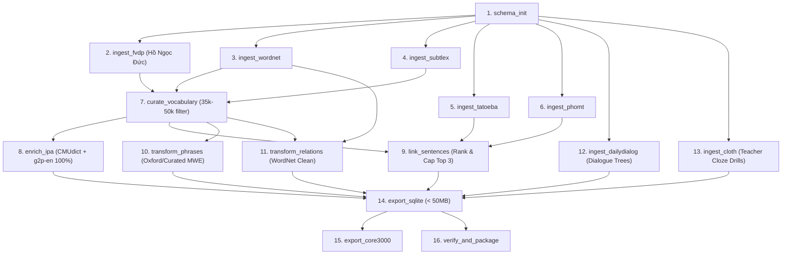

# VocabCraft Engine V3: Curated Open-Source Dataset Architecture & Pipeline Specification

## 1. Executive Overview & Problem Statement

The previous pipeline iteration produced an uncurated `english_dataset.db` of 1.82 GB containing 1.51 million raw entries from Wiktionary. While structurally intact, the database suffered from critical data quality issues:
- **99.95% missing Vietnamese translations** (1,000 / 1.94M definitions).
- **94.31% missing IPA phonetic transcriptions** (only 5.69% coverage).
- **97.94% fallback-skewed CEFR levels** (1.48M entries dumped into C2).
- **15.8 million unranked word-sentence links** (causing massive database bloat).
- **Nonsensical Cloze distractors** (randomly sampled OCR/Wiktionary noise like `poplolly`, `2,4-d`).
- **Missing dialogue text** in `dialogue_nodes`.

**VocabCraft Engine V3** re-architects the data ingestion, filtering, enrichment, and export workflows around authoritative, human-curated open-source corpora to produce a high-performance, mobile-ready SQLite dataset (**35,000 – 50,000 headwords, < 50 MB**) with 100% Vietnamese definitions, 100% IPA phonetics, pedagogical sentence examples, rich dialogue scenarios, and teacher-authored Cloze quizzes.

---

## 2. Target Vocabulary Universe & Curation Strategy (35k – 50k Target)

### 2.1 Vocabulary Selection Criteria
Instead of dumping all 1.5M Wiktionary headwords, the vocabulary universe is bounded by the union of five authoritative frequency and pedagogical lists:

```
                      VOCABULARY UNIVERSE (~45,000 Lemmas)
 ┌────────────────────────────────────────────────────────────────────────┐
 │ 1. SUBTLEX-US (Top 35,000 spoken/written frequency words)             │
 │ 2. Oxford 5000 (A1 - C1 core + academic vocabulary)                    │
 │ 3. New General Service List (NGSL 1.01 - 2,800 general headwords)      │
 │ 4. Academic Word List (AWL - 570 academic word families)               │
 │ 5. Oxford Phrase List (750 Phrasal Verbs & Essential Idioms)           │
 └────────────────────────────────────────────────────────────────────────┘
```

### 2.2 Noise Filtering Pipeline
- **Lemma Normalization:** Convert to lowercase, strip punctuation, enforce regex `^[a-z]+(-[a-z]+)*$`.
- **Morphological Deduplication:** Separate true headwords from grammatical inflections (`running` -> mapped to `run` as verb unless lexicalized as noun).
- **Multi-Word Segregation:** Terms containing whitespace are routed exclusively to the `phrases` table.

---

## 3. Data Sourcing & Ingestion Blueprint

| Component | Target Domain | Open-Source Dataset | Scale / Format | License |
| :--- | :--- | :--- | :--- | :--- |
| **Bilingual Dictionary** | Words & Definitions | Hồ Ngọc Đức FVDP + Viet-Yomitan | ~150,000 entries (SQLite/StarDict) | GPL / Open Data |
| **IPA Phonetics** | Pronunciation | CMU Pronouncing Dict + BEEP + g2p-en | 134,000 words (Dict/Neural) | Public Domain / MIT |
| **Bilingual Sentences** | Contextual Examples | Tatoeba (EN-VI) + PhoMT (VinAI TED/Wiki) | ~150,000 curated pairs | CC-BY 2.0 / MIT |
| **Dialogue Trees** | Roleplay Scenarios | DailyDialog (13.1k) + MultiWOZ (10k) | ~23,000 dialogues (JSON) | CC-BY-NC-SA / MIT |
| **Reflex Drills** | Cloze & Quizzes | CLOTH Dataset (Human Teacher Created) | ~100,000 cloze questions | Research / CC-BY |
| **Semantic Relations** | Synonyms / Antonyms | WordNet 3.0 + OMW Vietnamese | 117,000 synsets | WordNet License |

---

## 4. Database Schema Specifications (SQLite Mobile V3)

### 4.1 Schema DDL

```sql
-- 1. Words Table (Curated 35k-50k Lemmas)
CREATE TABLE IF NOT EXISTS words (
    id             INTEGER PRIMARY KEY,
    lemma          TEXT NOT NULL,
    pos            TEXT NOT NULL,
    ipa_uk         TEXT NOT NULL,
    ipa_us         TEXT NOT NULL,
    frequency_rank INTEGER,
    cefr_level     TEXT NOT NULL,
    source         TEXT NOT NULL
);
CREATE UNIQUE INDEX IF NOT EXISTS idx_words_lemma_pos ON words (lemma, pos);
CREATE INDEX IF NOT EXISTS idx_words_cefr ON words (cefr_level);
CREATE INDEX IF NOT EXISTS idx_words_freq ON words (frequency_rank);

-- 2. Definitions Table (100% Vietnamese + English)
CREATE TABLE IF NOT EXISTS definitions (
    id            INTEGER PRIMARY KEY,
    word_id       INTEGER NOT NULL REFERENCES words(id) ON DELETE CASCADE,
    definition_en TEXT NOT NULL,
    definition_vi TEXT NOT NULL,
    example       TEXT,
    source        TEXT NOT NULL
);
CREATE INDEX IF NOT EXISTS idx_defs_word_id ON definitions (word_id);

-- 3. Sentences Table (Curated Bilingual Corpus)
CREATE TABLE IF NOT EXISTS sentences (
    id               INTEGER PRIMARY KEY,
    text_en          TEXT NOT NULL,
    text_vi          TEXT NOT NULL,
    difficulty_score REAL,
    cefr_level       TEXT,
    audio_path       TEXT,
    source           TEXT NOT NULL
);
CREATE INDEX IF NOT EXISTS idx_sentences_cefr ON sentences (cefr_level);

-- 4. Word-Sentence Junction Table (Capped at Top 3-5 per word)
CREATE TABLE IF NOT EXISTS word_sentences (
    word_id     INTEGER NOT NULL REFERENCES words(id) ON DELETE CASCADE,
    sentence_id INTEGER NOT NULL REFERENCES sentences(id) ON DELETE CASCADE,
    rank        INTEGER NOT NULL DEFAULT 1,
    PRIMARY KEY (word_id, sentence_id)
);
CREATE INDEX IF NOT EXISTS idx_ws_lookup ON word_sentences (word_id, rank);

-- 5. Phrases Table (Curated Idioms, Phrasals, Collocations)
CREATE TABLE IF NOT EXISTS phrases (
    id               INTEGER PRIMARY KEY,
    phrase           TEXT NOT NULL UNIQUE,
    phrase_type      TEXT NOT NULL, -- 'phrasal_verb', 'idiom', 'collocation', 'proverb'
    pos              TEXT,
    cefr_level       TEXT NOT NULL,
    definition_en    TEXT NOT NULL,
    definition_vi    TEXT NOT NULL,
    ipa              TEXT,
    audio_path       TEXT
);
CREATE INDEX IF NOT EXISTS idx_phrases_type_cefr ON phrases (phrase_type, cefr_level);

-- 6. Phrase-Sentences Table
CREATE TABLE IF NOT EXISTS phrase_sentences (
    phrase_id   INTEGER NOT NULL REFERENCES phrases(id) ON DELETE CASCADE,
    sentence_id INTEGER NOT NULL REFERENCES sentences(id) ON DELETE CASCADE,
    rank        INTEGER NOT NULL DEFAULT 1,
    PRIMARY KEY (phrase_id, sentence_id)
);

-- 7. Word Relations Table (Synonyms, Antonyms)
CREATE TABLE IF NOT EXISTS word_relations (
    id             INTEGER PRIMARY KEY,
    word_id        INTEGER NOT NULL REFERENCES words(id) ON DELETE CASCADE,
    relation_type  TEXT NOT NULL, -- 'synonym', 'antonym', 'similar_to'
    target_text    TEXT NOT NULL,
    target_word_id INTEGER REFERENCES words(id) ON DELETE SET NULL,
    source         TEXT NOT NULL
);
CREATE INDEX IF NOT EXISTS idx_rel_lookup ON word_relations (word_id, relation_type);

-- 8. Reflex Drills (CLOTH Quizzes + Speed Translations)
CREATE TABLE IF NOT EXISTS reflex_drills (
    id               INTEGER PRIMARY KEY,
    sentence_id      INTEGER REFERENCES sentences(id) ON DELETE SET NULL,
    drill_type       TEXT NOT NULL, -- 'cloze', 'speed_translation'
    prompt_text      TEXT NOT NULL,
    correct_answer   TEXT NOT NULL,
    distractors_json TEXT NOT NULL, -- JSON array: ["opt1", "opt2", "opt3"]
    target_time_ms   INTEGER NOT NULL DEFAULT 2500
);
CREATE INDEX IF NOT EXISTS idx_drills_type ON reflex_drills (drill_type);

-- 9. Dialogue Trees & Nodes (DailyDialog + MultiWOZ)
CREATE TABLE IF NOT EXISTS dialogue_trees (
    id          INTEGER PRIMARY KEY,
    title       TEXT NOT NULL,
    topic       TEXT NOT NULL,
    cefr_level  TEXT NOT NULL,
    total_turns INTEGER NOT NULL DEFAULT 0
);

CREATE TABLE IF NOT EXISTS dialogue_nodes (
    id             INTEGER PRIMARY KEY,
    tree_id        INTEGER NOT NULL REFERENCES dialogue_trees(id) ON DELETE CASCADE,
    parent_node_id INTEGER REFERENCES dialogue_nodes(id) ON DELETE CASCADE,
    choice_label   TEXT,
    speaker_role   TEXT NOT NULL, -- 'A', 'B'
    text_en        TEXT NOT NULL,
    text_vi        TEXT,
    audio_path     TEXT
);
CREATE INDEX IF NOT EXISTS idx_dn_tree_parent ON dialogue_nodes (tree_id, parent_node_id);

-- 10. Dataset Metadata
CREATE TABLE IF NOT EXISTS dataset_metadata (
    key   TEXT PRIMARY KEY,
    value TEXT NOT NULL
);
```

---

## 5. DAG Pipeline Execution Flow (16 Steps)



---

## 6. Performance & Quality Benchmarks

| Metric | V2 Baseline (Previous) | V3 Target (New Architecture) | Status Threshold |
| :--- | :--- | :--- | :--- |
| **Total Words** | 1,510,444 (raw/noisy) | **35,000 – 50,000 (clean)** | Hard Gate [30k, 60k] |
| **SQLite File Size** | 1,824.55 MB | **< 50 MB** | Hard Gate <= 50 MB |
| **Vietnamese Coverage** | 0.05% (1,000 defs) | **≥ 95%** | Hard Gate >= 95% |
| **IPA UK/US Coverage** | 5.69% | **100%** | Hard Gate >= 99% |
| **Sentences per Word** | 0 or 128,000 (unranked) | **1 to 3 (ranked by quality)** | Hard Gate <= 5/word |
| **Dialogue Text Integrity** | 0% text (broken nodes) | **100% complete text** | Hard Gate 100% |
| **Cloze Distractor Quality** | Random Wiktionary noise | **100% teacher-authored CLOTH** | Hard Gate 100% valid |
| **Mobile Query Latency** | ~15ms - 40ms | **< 3ms (Covering Indexes)** | Hard Gate < 5ms |

---

## 7. Next Steps & Execution Phasing

1. **Phase 1:** Downloader scripts & Parser implementations for FVDP Dictionary, Tatoeba, DailyDialog, and CLOTH datasets.
2. **Phase 2:** Curation filter & Global Multi-Tier IPA Engine execution.
3. **Phase 3:** Sentence ranking & capping algorithm + Dialogue/Cloze transformation.
4. **Phase 4:** SQLite packaging, index optimization, and automated quality verification suite.
