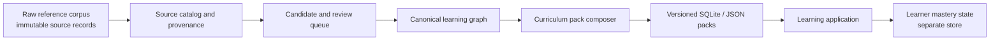

# Canonical Learning Graph Engine — Design Specification

**Status:** Approved design — pending implementation plan and user review
**Date:** 2026-08-17
**Decision:** Reframe the data pipeline as a curriculum-first canonical learning graph. The existing large English corpus remains a governed reference layer; it is not itself the learner curriculum.

## 1. Purpose and decision context

`english_dataset.db` contains valuable raw lexical and example material, but scale alone does not make it suitable for a beginner English-learning product. It has uneven frequency, CEFR, IPA, translation, sentence, dialogue, and exercise quality. A course must deliberately decide what to teach, in what order, and how each piece supports a communicative outcome.

The engine will therefore publish small, coherent, versioned curriculum packs from a canonical content graph. It will not export every record in the reference corpus to learners.

The initial product audience is Vietnamese adult learners moving from A0 toward independent everyday communication at B1. The scope is backend/content-engine infrastructure only; it does not prescribe a mobile or web UI.

## 2. Product outcomes and success criteria

The engine must make the following outcomes possible:

- A learner can study content organized around a real communicative objective, rather than a detached word list.
- Every published item has clear provenance, a quality status, and a reproducible pack version.
- A word, phrase, sentence, dialogue turn, and activity can be traced to the objective and curriculum module it serves.
- Content selection is intentional: high-value communication content is surfaced before long-tail reference material.
- Learner progress can be measured independently of source data and independently of the published pack implementation.

The A0–B1 launch curriculum is a bounded learning product, not a coverage claim over the English language. Its indicative target is:

| Content type | A0–B1 target | B2 extension target |
| --- | ---: | ---: |
| Active word families | 2,800–3,000 | 4,500–5,500 |
| Chunks and collocations | about 3,000 | 4,000–4,500 |
| Reviewed, audio-backed example sentences | 5,500–6,500 | 9,000–12,000 |
| Grammar/communication patterns | about 350 | 550–650 |
| Scenarios | 140–160 | 240–280 |
| Dialogue turns | 1,600–2,200 | 3,000–4,000 |

These are curriculum concepts. They do not mean every learner must memorize every entry, and they do not grant publication approval to automatically generated entries.

## 3. Scope and non-goals

### In scope

- A durable content model, ingestion boundary, review workflow, quality gates, and deterministic pack publishing contract.
- A canonical graph that links communicative objectives to lexical, sentence, dialogue, and practice content.
- Importing eligible records from the current reference database as candidates, with preserved source evidence.
- Support for human review and calibrated automated signals.
- An explicit boundary for learner-state data.

### Out of scope

- User interface, lesson visual design, payment, social features, or real-time AI tutor behavior.
- Claiming CEFR, IPA, translation, or audio correctness merely because a field is non-empty.
- Treating arbitrary reading comprehension or dictionary data as spoken beginner material.
- Deleting source/reference records during curation.
- Releasing material with unknown or incompatible source licensing.

## 4. Architecture and ownership boundaries

### 4.1 Raw reference corpus

This layer stores imported source material with its original identity, payload where licensing permits, normalized representation, source hash, import run, and known limitations. It is append-only in principle. Corrections and enrichment belong in later layers; they must not overwrite or delete the original evidence.

The current `english_dataset.db` is an input/reference artifact to this layer. It is useful for candidate discovery, but it is not a production curriculum pack.

### 4.2 Source catalog and provenance

Every importable asset needs a source-catalog record before it can feed published content. The catalog stores publisher/repository, retrieval URL, asset version or commit, license text or verified license identifier, attribution requirement, permitted uses, retrieval time, checksum, and validation status.

An asset with no verified redistribution/use right may remain quarantined for investigation but must not supply published text, translations, audio, or derived exercise data.

### 4.3 Candidate and review queue

Candidates are proposed lexical senses, chunks, sentences, dialogue materials, translations, or activities. They retain links to the raw records from which they came. Automated ranking may prioritize work; it never replaces a publication decision.

The review queue records the review state, reviewer, decision reason, evidence, quality scores, and a content revision. Rejected or quarantined candidates stay traceable and are excluded from pack composition.

### 4.4 Canonical learning graph

The canonical graph contains approved educational concepts and their relationships. It is the source of truth for curriculum composition. It contains no learner-specific spaced-repetition schedule, streak, or mastery result.

### 4.5 Curriculum pack composer

The composer resolves a declared curriculum version into a finite set of approved graph nodes, validates it, and emits a versioned portable SQLite/JSON package plus a manifest. A pack is immutable after publication; corrections create a new pack version.

### 4.6 Learner state

Learner state is a separate operational store keyed by stable canonical-content identifiers and activity attempts. It can store exposure, recall, pronunciation assessment, mastery estimates, and scheduling. It must never alter a pack's content meaning or silently make unreviewed candidates visible.

## 5. Canonical content model

The model is relational in storage but conceptually a graph. Stable identifiers are immutable; revisions are versioned records rather than destructive updates.

| Entity | Responsibility | Essential relationships |
| --- | --- | --- |
| `learning_objective` | A communicative capability, e.g. “ask for directions politely”. | Has prerequisites; selects patterns, chunks, senses, scenarios, and assessment criteria. |
| `curriculum_module` | A teachable sequence/unit for a proficiency band. | Orders objectives; declares entry prerequisites and pack inclusion. |
| `lexeme` | A headword independent of a particular meaning. | Has forms and senses. |
| `sense` | A teachable meaning/POS for a lexeme. | Links to definitions, translations, objectives, examples, and CEFR evidence. |
| `form` | Inflection, spelling, pronunciation variant, or register form. | Belongs to a lexeme/sense where applicable. |
| `chunk` | A reusable multiword unit/collocation. | Connects to senses, patterns, objectives, and example sentences. |
| `pattern` | A grammatical or discourse construction with a communicative use. | Connects to objectives, chunks, examples, and assessment constraints. |
| `sentence` | A reviewed English example with translation and optional audio. | Demonstrates senses/chunks/patterns; supports activities. |
| `audio_asset` | Recorded/synthesized sound with rights and QA metadata. | Attaches to a sentence or dialogue turn; cannot be inferred from a path alone. |
| `scenario` | A bounded communicative situation, goal, roles, setting, and register. | Contains dialogue graph(s) and objective coverage. |
| `dialogue_turn` | A learner or partner utterance in a scenario. | Has a speaker, sentence, response paths, and optional alternatives. |
| `response_path` | A meaningful branch/continuation, not merely the next linear line. | Connects dialogue turns; can carry constraints and outcome. |
| `activity_template` | A reusable exercise type. | Defines required inputs, grading rules, and permitted distractor policy. |
| `assessment_criterion` | Observable evidence of objective achievement. | Used by activity instances and learner state. |
| `content_evidence` | Provenance and quality evidence for a node/revision. | Connects an item to raw source, model output, review, and rationale. |
| `content_review` | Approval lifecycle record. | Attaches to a content revision; captures reviewer and decision. |
| `curriculum_pack` | Immutable selected curriculum version. | Includes module/objective/content revisions and manifest. |

### 5.1 Learning objective is the organizing unit

Objectives are function-first. Each objective includes:

- proficiency band and calibrated difficulty range;
- learner-facing communicative outcome;
- pragmatic context, roles, and register;
- prerequisite objectives and prerequisite knowledge;
- required/recommended senses, chunks, patterns, and pronunciation focus;
- evidence of success (what the learner can understand, say, choose, or repair);
- coverage requirements for examples, dialogue practice, and assessment.

For example, “ask for directions politely” can require the chunks “Excuse me”, “How do I get to …?”, and “Is it far from here?”, the pattern `How do I get to + place?`, a city-navigation scenario, and a criterion that the learner can ask for a destination and respond to a clarification.

### 5.2 Lexical meaning and calibration

Lexeme, sense, and form must be separate. “Bank” as a financial institution and “bank” as a river edge are different teachable senses. The graph never relies on one word-level CEFR field to represent all senses.

CEFR is an evidence-backed estimate with a method and confidence, not a fallback label. Published beginner material requires a calibrated level or explicit reviewer decision. Uncertain values are held in review; they are not defaulted to C2 or any other band.

Pronunciation records hold variant, transcription source, confidence, and reviewer decision. A generated grapheme-to-phoneme result may be a candidate but cannot be labeled equivalent to verified UK and US pronunciations. Empty/placeholder output is invalid, not complete.

### 5.3 Sentence, translation, and audio model

Each publishable sentence records English text, intended meaning, target use, approved Vietnamese translation, source evidence, level evidence, naturalness/relevance scores, and review status. It may link to multiple senses/chunks/patterns, but its role for each linkage is explicit.

Audio must record the asset checksum, locale/accent, voice/source, licensing evidence, duration, transcript alignment status, and quality status. A non-null filename does not demonstrate that audio exists or matches the text.

### 5.4 Scenarios and dialogues

Scenarios must have a learner goal, context, roles, register, intended objectives, and an explicit end condition. Dialogue structure is a directed graph: a branch represents a learner-relevant alternative or response condition. A linear dialogue is valid only when the experience is truly linear; it must not be presented as choice-driven practice.

Every publishable turn has actual text, speaker role, translation policy, content-review state, and (when audio is promised) validated audio. Conversation data from a source such as a cloze-reading dataset is a candidate only if it meets this scenario purpose after review.

### 5.5 Activities and distractors

Activities are instantiated from templates tied to an objective and required evidence of achievement. The engine must distinguish recognition, controlled production, guided speaking, listening, and free response. Distractors are selected from reviewed candidates that match the required part of speech, level, semantic distance, and grammatical frame; random global words are not allowed.

## 6. Quality policy and publication gates

Quality is additive: an item must satisfy mandatory gates and meet an appropriate score threshold. Low confidence does not become correct by being numerically present.

| Gate | Mandatory rule for published content |
| --- | --- |
| Source and rights | Source asset, checksum, license/use evidence, and attribution obligations are recorded and compatible with publication. |
| Identity | Canonical item has stable ID, revision, raw provenance, and no unresolved duplicate/conflict. |
| English quality | Text is grammatical, natural for its intended register, safe, and semantically fits the target objective. |
| Vietnamese quality | Translation conveys the intended sense, level, and pragmatics; it is reviewed or has explicit qualified evidence. |
| Difficulty | CEFR/difficulty has evidence and confidence; items outside the module range are excluded or deliberately scaffolded. |
| Pronunciation | IPA/audio claims have source/confidence; placeholder or copied-accent values are not accepted as verified. |
| Dialogue | Scenario goal, turn text, response path semantics, and completion state are valid. |
| Activity | Prompt, answer, distractors, and grading constraints meet the template's validation rules. |
| Pack integrity | Foreign keys, required coverage, media checksums, manifests, version consistency, and deterministic export pass. |

The pipeline must publish quality reports with counts by state (candidate, approved, rejected, quarantined), gate failures, source, CEFR band, and curriculum module. It must support stratified human sampling before a pack is promoted.

## 7. Curriculum composition rules

The composer includes only approved revisions referenced by the selected modules/objectives and resolves prerequisites before dependents. A content item may be reusable across modules, but its pack inclusion must name the reason: objective requirement, prerequisite, review lesson, or enrichment.

Each module must meet a declared coverage contract:

- at least one goal-appropriate scenario and assessed activity per objective;
- enough reviewed sentence/context coverage for every required sense, chunk, and pattern;
- a balanced mix of comprehension, controlled production, pronunciation/listening when audio is available, and communicative practice;
- no unresolved licensing, translation, or level uncertainty in required content;
- explicit downgrade/omission policy for optional audio or translation.

Frequency, corpus occurrence, and model scores are ranking signals for candidates. They are never direct rules for learner visibility. The product uses an intentional syllabus sequence rather than corpus frequency order.

## 8. Import, enrichment, review, and publishing flow

1. Register a source asset and verify its rights, checksum, schema, and retrieval metadata.
2. Import raw records into an append-only reference layer, retaining source identifiers and import-run provenance.
3. Normalize records into candidate concepts without deleting raw material.
4. Derive explicit candidate links, scores, and evidence (e.g., possible sense/example alignment or pronunciation candidate).
5. Route candidates to automated validation and human/content review.
6. Promote only approved revisions into the canonical learning graph.
7. Compose a declared curriculum pack, run hard gates and statistical quality reports, then sign/version its manifest.
8. Release the immutable pack. Learner-state services reference its stable content IDs but cannot modify it.

Any failed gate quarantines the affected candidate or pack. The system must preserve the failure reason and provenance so an operator can correct, re-review, or exclude it. Partial exports are not publishable releases.

## 9. Versioning, idempotency, and observability

All imports, review decisions, content revisions, and packs need immutable IDs and timestamps. A rerun with the same source checksum and configuration must be idempotent or explicitly create a new run/revision with an auditable reason.

A published pack manifest includes:

- pack ID, semantic version, build time, and curriculum version;
- canonical content revision IDs and source assets used;
- source/license attributions required by the pack;
- schema version and exporter version;
- quality-gate outcomes and coverage summary;
- SQLite/JSON/media checksums and expected file sizes.

Pipeline metrics include imported/candidate/approved/quarantined counts, review latency, duplicate rate, score distributions, objective coverage, media availability, and gate-failure rates. Logs must identify run ID, source asset ID, content revision ID, and pack ID rather than only aggregate counts.

## 10. Validation and test strategy

The implementation must make invalid states difficult to represent and must test them at the smallest relevant layer.

- Unit tests validate normalization, graph constraints, CEFR/IPA confidence rules, sentence/audio requirements, distractor constraints, and manifest construction.
- Property/integration tests verify imports and re-runs preserve raw provenance and do not destroy existing records.
- Schema-migration tests cover fresh databases and realistic pre-existing V2/V3 staging databases.
- Pack-composition tests verify prerequisite ordering, objective coverage, exclusion of unapproved content, deterministic selection, and reproducible checksums when input is unchanged.
- Release validation runs database integrity/foreign-key checks, required-field checks, media/text alignment checks, source-license checks, and quality-threshold reports.
- Human acceptance testing samples each level/module and checks communicative usefulness, Vietnamese translation, naturalness, and audio synchronization.

No end-to-end success criterion is satisfied merely by a pipeline completing without exception or by a row count reaching a target.

## 11. Migration and treatment of existing V2/V3 work

The existing reference artifact should be frozen as a versioned input snapshot and audited by source. It must not be destructively “curated” by deleting low-ranked rows from the only copy of lexical/sentence tables.

The following V3 ideas may be retained after the new data contracts exist:

- capped/ranked sentence selection, but only after sense, naturalness, level, translation, and objective-fit checks;
- dialogue text/audio fields, introduced with explicit migrations and completeness validation;
- SQLite compaction and manifest/checksum verification as release engineering;
- dedicated import parsers, only after their source URLs, schemas, licenses, and curricular fit are verified.

The following behaviors are rejected by this design:

- writing Vietnamese meanings into an English-definition field;
- calling an uninvoked CEFR heuristic a calibrated level assignment;
- treating generated or copied IPA as verified regional pronunciation;
- exposing linear source dialogue as branching dialogue without meaningful response paths;
- claiming V3 data guarantees solely through static schema additions, a file-size assertion, or non-null checks;
- mixing exporter/package versions for the same release.

Existing staging schemas require an explicit forward migration strategy. `CREATE TABLE IF NOT EXISTS` is insufficient to add fields or constraints to databases created by earlier versions.

## 12. Delivery phases

### Phase 0 — Source and curriculum foundation

Define the initial A0–A1 objective inventory, source catalog schema, rights-validation policy, canonical-ID/revision rules, and a small reviewed gold set. Select only sources whose availability, license, and data quality are verified.

### Phase 1 — Canonical graph and review workflow

Implement raw/source/candidate/canonical/review boundaries, migrations, evidence capture, objective-to-content links, and validation reports. Import a representative subset rather than the full corpus.

### Phase 2 — Curriculum pilot

Publish one small end-to-end module with reviewed vocabulary, chunks, patterns, examples, scenarios, activities, Vietnamese translations, and audio where promised. Evaluate it against the content and pack gates with human sampling.

### Phase 3 — Controlled expansion and publication

Expand module-by-module toward the A0–B1 targets, add pack manifests/delta/version handling, and operationalize review throughput and monitoring. B2 begins only when lower-level quality and coverage are demonstrably stable.

## 13. Explicit decisions requiring future implementation adherence

1. The reference corpus and the learner curriculum are different products with different data contracts.
2. The canonical learning graph, not an importer output or a raw database table, is the publication source of truth.
3. A communicative learning objective is the primary unit of curriculum composition.
4. Provenance, license evidence, confidence, review state, and revision are mandatory for publishable content.
5. All V2/V3 compatibility changes must be forward migrations tested on existing databases.
6. User mastery and scheduling remain outside the content database contract.
7. The first release is a small, reviewed A0–A1 vertical slice; scale follows demonstrated quality, not a headline row count.
