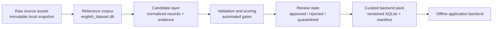

# Reference Corpus to Curated Backend Dataset

**Status:** Approved design
**Date:** 2026-08-17

## 1. Purpose

VocabCraft Engine needs a large, locally available English/Vietnamese corpus so a
learning application can search vocabulary, examples, phrases, and dialogues
without making per-request calls to paid third-party services.

The current `english_dataset.db` is a valuable reference snapshot, but it must
not be treated as a backend source of truth yet. It contains records with
missing, defaulted, weakly linked, or unverified fields. The system will keep
the large corpus as an immutable reference layer and publish a separate,
quality-gated dataset for backend use.

The design goal is therefore **trusted offline serving**, not perfecting every
record in the entire reference corpus before the application can be built.

## 2. Current evidence and constraints

The inspected snapshot contains approximately:

- 1.51 million word/POS records and 1.94 million definitions;
- 488 thousand bilingual sentences and 15.8 million word-sentence links;
- 27.8 thousand phrases and 954 thousand lexical relations;
- 100 thousand reflex drills and five dialogue tree shells.

The SQLite artifact is structurally sound (`quick_check` succeeds and the
foreign-key check returns zero violations), and indexed exact lookups are fast.
However, the snapshot has important content gaps: only 75,176 words have
sentence links, all exported sentences lack CEFR and audio paths, most word
records lack frequency and IPA evidence, and dialogue nodes have no usable
sentence content. These observations motivate a quality boundary rather than
more blind ingestion.

Build-time enrichment may use local models or controlled external services. The
application runtime must not depend on those services. Any build-time output
must record its method and provenance so it can be reviewed or regenerated.

## 3. Goals and non-goals

### Goals

- Preserve the large reference corpus without destructive cleaning.
- Make candidate provenance, transformation evidence, and quality state explicit.
- Publish a deterministic, versioned offline pack that the backend can serve
  without remote lookup or translation calls.
- Support incremental curation: a high-value vertical slice can be published
  before the whole corpus is reviewed.
- Keep rejected and quarantined records traceable for later correction.

### Non-goals

- Making every reference record suitable for learners.
- Building a mobile/web UI or learner mastery store.
- Replacing raw evidence with a single “cleaned” copy.
- Claiming that a non-null CEFR, IPA, translation, or audio path is correct.
- Requiring a particular build-time translation provider, as long as runtime
  serving remains self-contained and the provider is recorded.

## 4. Architecture



### 4.1 Reference layer

The current database remains a read-only input snapshot. New ingestion runs
create a new snapshot or import run; they do not delete low-ranked words,
replace original definitions, or overwrite source evidence.

Every source asset used by a run needs a manifest containing its publisher or
repository, retrieval URL, source version/date, checksum, license and
attribution evidence, retrieval time, and local path. The existing artifact
manifest checks the exported DB, but it is not a substitute for a raw-source
manifest.

### 4.2 Candidate layer

Candidates are normalized representations of a word sense, phrase, sentence,
translation, audio asset, or dialogue turn. A candidate retains:

- a stable candidate ID and source record ID;
- the source asset and import run;
- the original payload or a pointer to the immutable source snapshot;
- normalization and enrichment method/version;
- quality signals and unresolved warnings;
- links to related candidates.

Candidates are not visible to the backend merely because they exist.

### 4.3 Review and publication layer

Each candidate receives a lifecycle state:

```text
candidate -> validated -> approved
                    \-> rejected
                    \-> quarantined
```

The state change records the decision reason, evidence, reviewer or automated
validator version, timestamp, and content revision. Corrections create a new
revision; they do not erase the prior evidence.

The pack composer includes only approved revisions selected by the declared
pack contract. A backend query never silently falls back to the reference or
candidate layer.

## 5. Data contract for publishable records

All publishable entities share these fields conceptually, regardless of their
physical storage table:

- immutable canonical ID and revision ID;
- `quality_status = approved`;
- source asset ID, source record ID, import run, and source checksum;
- transformation/enrichment method and version;
- evidence and confidence for derived fields;
- review decision and timestamp;
- pack version that published the revision.

The backend pack additionally has a manifest with schema version, pack version,
build configuration, source attributions, quality-gate counts, coverage
summary, and checksums for every emitted file.

## 6. Quality gates

Quality is evaluated per entity and per relationship. A record is publishable
only when all mandatory gates for its feature pass.

| Entity | Mandatory gates before approval |
| --- | --- |
| Word/sense | Normalized lemma, POS in the pack's declared POS set, sense identity, source evidence, no unresolved duplicate, and frequency/level evidence or an explicit human review decision. |
| Definition | Non-empty English meaning, correct sense linkage, Vietnamese translation when required by the pack, and rejection of English passthrough or `[VI]` placeholders. |
| Pronunciation | At least one non-placeholder pronunciation with source and confidence; UK/US variants are not inferred to be equivalent without evidence. |
| Sentence | Non-empty English and Vietnamese text; normalized texts are not equal; language-profile and length-ratio checks pass; source evidence and an explicit target link exist; and the stratified human sample accepts naturalness, safety, and intended meaning. |
| Phrase | Canonical chunk or collocation classification, meaning, translation policy, and at least one approved contextual sentence. |
| Dialogue | Scenario goal, roles, real turn text, valid graph links, translation policy, and an explicit completion/branch condition. |
| Audio | Existing file, checksum, locale/voice metadata, transcript alignment, rights evidence, and audio QA state. A filename alone is not sufficient. |
| Relationship | Both endpoints exist, relationship type is allowed, and the relationship is not an unreviewed artifact of string matching. |

Automated validators can reject obvious failures and prioritize review. They do
not turn a weak score into approval. Before a pack is released, its human
acceptance sample contains at least 30 approved records for every populated
source-by-entity-type cell; for entities published with CEFR, it also contains
at least 30 records for every populated CEFR band. A rejected sample record is
quarantined with its reason and triggers a new sample for that cell.

## 7. First curated vertical slice

The first slice proves the complete path from reference data to backend data. It
should prioritize high-frequency, single-word lexical content rather than the
entire 1.5 million-row vocabulary.

### Selection

- word/POS records with `1 <= frequency_rank <= 3500`;
- only `noun`, `verb`, `adj`, `adv`, `prep`, `pron`, `det`, `conj`, `intj`,
  `article`, or `num` POS values;
- normalized single-word lemmas matching `^[a-z]+(-[a-z]+)*$` after lowercase
  normalization; names, symbols, prefixes, suffixes, and multi-word lemmas are
  excluded from the first pack;
- retain multiple senses only when each sense has independent evidence.

### Required coverage

Every included word/sense must have:

- an approved English definition;
- an approved Vietnamese meaning when the pack targets Vietnamese learners;
- at least one evidence-backed pronunciation;
- at least one approved linked sentence with English and Vietnamese text;
- a source/provenance record and quality decision.

Phrases, full-text sentence search, audio, and dialogues are separate contracts;
they must not be represented as complete merely because the lexical slice is
complete. The next slice can add approved phrases and sentence search, followed
by a dialogue-specific slice with real turns.

## 8. Backend serving contract

The backend uses only a published curated pack. It must:

- query approved records by stable IDs and indexed lookup keys;
- return explicit “not available in this pack” when a record is absent;
- never call a translation, dictionary, TTS, or sentence API at request time;
- expose pack version and content provenance for diagnostics;
- keep learner state separate from immutable content.

Exact vocabulary, phrase, and linked-example lookups can continue to use the
existing indexed SQLite pattern. If the product needs arbitrary sentence or
Vietnamese-text search, the curated pack must add a deliberate full-text search
contract rather than relying on unindexed `LIKE` scans.

## 9. Determinism and observability

A rerun with identical source checksums and configuration must produce the same
candidate decisions and curated-pack checksum. If a model or external
build-time service changes, the run must create a new enrichment/version record.

Each run reports, by source and entity:

- imported, candidate, validated, approved, rejected, and quarantined counts;
- missing-field and gate-failure counts;
- duplicate/conflict rates;
- review samples and decisions;
- pack coverage and file checksums.

Pipeline success is not defined by process completion or row count alone. A
quality report and pack validation must pass before publication.

## 10. Verification strategy

- Unit tests cover normalization, placeholder detection, language validation,
  sense/relationship rules, and gate decisions.
- Import tests prove source IDs and raw payloads survive reruns without deletion.
- Curated-pack tests prove unapproved records cannot be exported.
- Determinism tests compare output checksums for identical inputs/configuration.
- Release tests run SQLite integrity, foreign keys, required-field checks,
  relationship checks, media checksums, and manifest consistency.
- Human acceptance samples each source and feature represented in the pack.

## 11. Decision

Adopt the separate reference/candidate/curated architecture. The first
implementation should build the quality audit and the lexical vertical slice,
then publish a small verified pack for backend integration. Expanding corpus
coverage comes only after the gates and review evidence are trustworthy.
